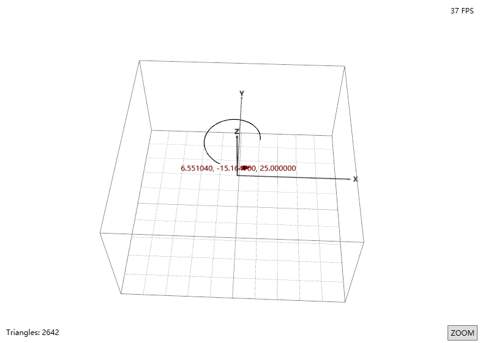

# HelixTraceApp

HelixTraceApp是一个用于绘制轨迹动画的软件。使用`C#`和`Helix-Toolkit`。

HelixTraceApp is a software that can be used to pltting data trajectory. Use `C#` and `Helix-Toolkit`.

参考了[此处Demo](https://www.codeproject.com/Articles/1246255/Plotting-a-Real-time-D-Toolpath-with-Helix-Toolkit)，并进行了一定的改造。

Refering to [this Demo](https://www.codeproject.com/Articles/1246255/Plotting-a-Real-time-D-Toolpath-with-Helix-Toolkit), and change some code.



## 背景 Background

在Windows上处理一些大量轨迹数据的时候，需要绘图进行分析，过去使用的`gnuplot`显得有些力不从心，无论是使用`wxt`还是`qt`反应速度都无法让人满意。究其原因，似乎二者都不是使用GPU进行绘图，而是使用CPU进行绘图，在进行图形绘制时，计算量过大。

另外一点是，`gnuplot`无法进行点位动画的展示，尝试使用`r`的`plotly`包生成`HTML`网页进行动画展示，同样的问题出现了，在数据量过大的情况下，生成网页数据很慢，打开很慢，效果很差。

在网上查询后，发现了相关绘图库，并发现了一位前辈写的简单Demo，经过一定改写后，加入了文件读取功能，改进了一部分代码，提高了绘图速度。

## 编译 Build

使用Visual Studio打开工程后，编译即可。

Use Visual Studio open the solution file, and build.

测试VS2019编译成功。注意.Net版本。

VS2019 can build successfully. Please check the `.Net` version correctly.

## 使用

### 准备数据文件

本软件是读取数据文件后，再做动画绘图的过程，所以需要预先准备好数据文件。

This software read the data file, then plot and display animation. So need to prepare the data file before.

数据文件格式为：每行写一个点的数据，数值用空格分开。可以两个数据，也可以三个数据。

The data file format is: each line has one point data, the data value split by spaces. The point data can have two or three value.

举例如下：

For example:

```text
0 0 0
10 10 10
15 10 10
```

### 执行程序 Execute

运行编译后程序，会弹出文件选择框，选择数据文件，即可开始绘图。

Build and exeucte, then choose the data file, and plotting.

## To-Do

1. 修复巨量数据绘图刷新率低的问题
1. 使得网格框可以跟随图像大小自动变化
1. 可以使网格框显示消失的按钮
1. 图像可以进行移动
1. 加入绘图速度条件滑动条
1. 加入立即绘图按钮

## License

MIT